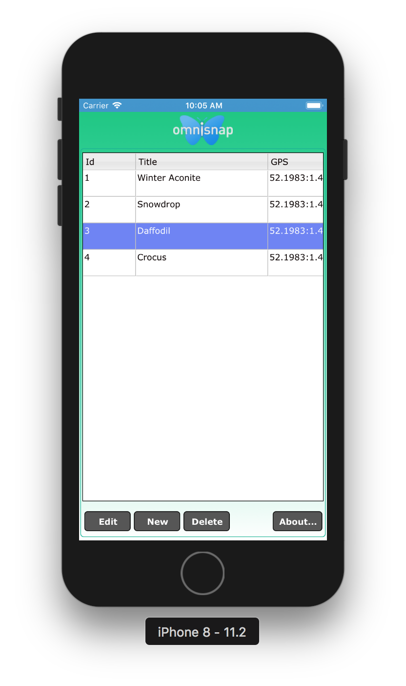
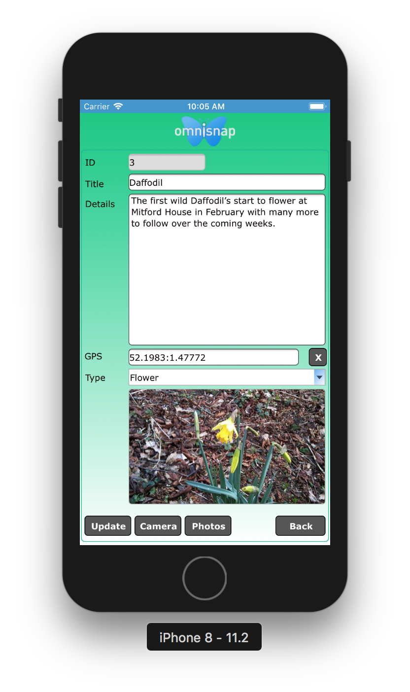

# Omnis-ServerlessClient
For Omnis Studio 8.1.1 and above (serialised with a serverless serial number).
Also requires Javascript wrapper available from http://www.omnis.net/download/jswrapper.jsp.

## Description

A Sample application which can run totally offline within the Javascript wrapper using local sqlite data storage and the device control for GPS and Photos.

## Contents

This repository includes the following:

### OMNISNAP

This folder contains the source JSON files for the OmniSnap Omnis Library.

To restore these files in Omnis Studio, click on the Libraries option in the Studio Browser, and click on the New Lib from JSON option. In the New Library (import) dialog, navigate to this source folder (containing library.json), and then specify a different folder or location for the new Library. Click on Import and open the library in the Studio Browser.

### Resources

This folder contains the 'omnisnap' iconset. You should copy the 'omnisnap' folder from *Resources/html/icons* to your Omnis installation's *html/icons* directory (in the writeable files section of the install), and also into the *icons* directory at the same level as your *.htm* file on your web server, if you are using one.

### omnisnapdata.db

A sqlite database containing sample data used by OmniSnap for internal storage on your device.

## Wrapper Setup

- Add omnisnapdata.db to your wrapper resources folder for iOS or assets folder for Android.

- Configure your wrapper (config.xml) with the following settings:

  ServerOmnisWebUrl = ipaddress:omnis port
  
  ServerLocalDatabaseName = omnisnapdata.db
  
  ServerOnLineFormName = /jschtml/jsSnap
  
  ServerOffLineFormName = jsSnap
  
  ServerAppScafName = omnisnap

Note you need to test the form jsSnap in the OmniSnap library to generate jsSnap.htm to initially run online for testing and then used offline in the wrapper as specified in config.xml.
